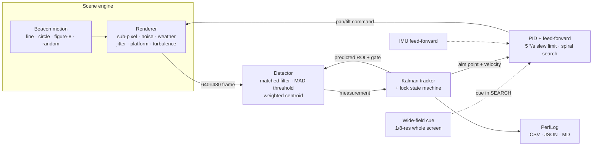

<div align="center">

# 🛰️ BEACON-SIM

### AI-based virtual camera tracking for coarse alignment of mobile FSOC terminals

**Find the beacon. Lock it. Keep it.**


Smart India Hackathon 2026 · Problem Statement **SIH26169** (ISRO) · Team **Larpers**


</div>

---

## Table of contents

- [Overview](#overview)
- [Features](#features)
- [Results](#results)
- [Quick start](#quick-start)
- [Usage](#usage)
- [How it works](#how-it-works)
- [Performance logs](#performance-logs)
- [Scenarios and configuration](#scenarios-and-configuration)
- [Project structure](#project-structure)
- [Testing](#testing)
- [Assumptions](#assumptions)
- [Roadmap](#roadmap)
- [License](#license)

## Overview

Free-space optical communication (FSOC) sends data on a very narrow laser beam, so two terminals on ships, vehicles, drones or satellites first have to find each other and point accurately. **Coarse alignment** is the job of a camera on a pan-tilt mount. The camera spots the partner's beacon, centres it and keeps it centred while both platforms move, vibrate and look through haze, fog, rain or turbulence.

BEACON-SIM is a complete, reproducible software testbed for that loop:

- **Scene:** a 2000 × 2000 px screen, with a moving square beacon on a sky and star background.
- **Camera:** a virtual 640 × 480 mono camera with a 4° × 3° field of view, running at 30 Hz. It starts pointed at the screen centre.
- **Tracking:** a detection → Kalman tracking → PID control pipeline drives the virtual mount, capped at the official 5 °/s slew limit.
- **Scoring:** every run writes a performance log that is checked against the official ISRO specs.

| Official spec (SIH26169) | Target | BEACON-SIM (worst preset) |
|---|---|---|
| Acquisition time | ≤ 2 s | **≤ 1.03 s** |
| Mean tracking error | ≤ 10 px | **≤ 8.5 px** |
| Target loss | < 5 % | **0 %** |
| Re-acquisition time | ≤ 1 s | **≤ 0.13 s** |
| Processing rate | ≥ 20 FPS | **≥ 105 FPS** |

## Features

- 🎯 **Sub-pixel detection.** A matched filter, an adaptive median/MAD threshold and an intensity-weighted centroid give about 0.2 px RMSE against ground truth.
- 🧭 **Robust tracking.** A constant-velocity Kalman filter drives a `SEARCH → ACQUIRE → LOCK → COAST → REACQUIRE` state machine with an adaptive innovation gate.
- 🎮 **Realistic mount control.** PID with velocity feed-forward, slew-rate limit, deadzone and an Archimedean spiral search.
- 🌫️ **Official disturbance set:**
  - noise: salt-and-pepper (up to 10 %), Gaussian (σ up to 20) and Poisson;
  - weather: haze, fog, rain and low light;
  - motion: ±20 px/frame LOS jitter and linear/circular/figure-8/random platform motion;
  - turbulence: Rytov-based scintillation, beam wander and blur;
  - occlusions.
- 🛰️ **IMU feed-forward.** Models gyro-aided stabilisation of platform motion and jitter; it can be turned off for ablation.
- 🎞️ **Benchmark-2 mode.** Runs on grader MP4 videos with the PTZ loop bypassed and scores centroids against a ground-truth CSV.
- 📊 **Automatic performance logs.** Per-frame CSV plus a JSON and Markdown summary with PASS/FAIL against each spec and a config hash.
- 🖥️ **Live dashboard.** Camera view, screen overview, lock-state timeline, event log, PASS/FAIL scorecards, error plot, live disturbance sliders and a one-click scripted **Judge demo**.
- 🔁 **Reproducible.** Seeded scenarios, YAML configs and identical results for identical seeds.
- 💻 **Lightweight.** Pure Python, CPU only, offline, no GPU and no paid licences.

## Results

Each preset ran for 3 seeds × 30 s. The raw logs are in [`results/sweep/`](results/sweep/) and the table is in [`results/sweep/sweep_table.md`](results/sweep/sweep_table.md).

| Preset | Disturbances | Acquisition | Mean error | Centroid RMSE | Target loss | Max re-acq. | Min FPS | Specs |
|---|---|---|---|---|---|---|---|---|
| `SIH-OFFICIAL` | clean, figure-8, occlusion | 0.07–0.43 s | 2.9–3.5 px | 0.18 px | 0 % | 0.03 s | 199 | ✅ 3/3 |
| `NOISY` | 10 % S&P, σ 20, Poisson, jitter 6 | 0.07–0.57 s | 3.2–3.8 px | 0.20 px | 0 % | 0.03 s | 188 | ✅ 3/3 |
| `FOG-JITTER` | fog, jitter 12, platform, circle | 0.40–0.50 s | 4.0–4.1 px | 0.17 px | 0 % | 0.03 s | 123 | ✅ 3/3 |
| `RAIN-LOWLIGHT` | rain, noise, random motion | 0.10–0.37 s | 5.9–6.6 px | 0.18 px | 0 % | 0.03 s | 123 | ✅ 3/3 |
| `SEVERE` | **everything at max** + turbulence | 0.10–1.03 s | 7.8–8.5 px | 0.71 px | 0 % | 0.13 s | 105 | ✅ 3/3 |

**Benchmark-2** (2000 × 2000 grader-style MP4 at 30 fps, PTZ bypassed): centroid RMSE **0.21 px**, acquisition **0.07 s**, **100 %** lock retention.

**Ablation, IMU feed-forward off** ([`results/sweep_no_imu/`](results/sweep_no_imu/)): `SEVERE` mean error rises from about 8 px to **38.5 px** and fails the spec. All other presets still pass, so the vision pipeline alone handles every single disturbance. Stabilisation is needed only when everything is at maximum at once.

> FPS is measured for the tracking pipeline (detection, tracking and control) on a laptop CPU. Scene rendering and the GUI are excluded because they stand in for the real camera.

## Quick start

Requirements: Python 3.10+ on Windows, Linux or macOS.

```bash
git clone <this-repo-url> beacon-sim
cd beacon-sim
python -m venv .venv
# Windows
.venv\Scripts\activate
# Linux / macOS
source .venv/bin/activate

pip install -r requirements.txt
python -m beacon_sim            # launch the dashboard
```

Click **★ Judge demo** for a scripted 40-second run. It steps through noise, occlusion, fog and jitter, rain, low light and platform motion, and haze and turbulence, then exports the performance log.

You can also install it as a package: `pip install -e .[dev]`, then run `beacon-sim`.

## Usage

| Command | What it does |
|---|---|
| `python -m beacon_sim` | Dashboard GUI |
| `python -m beacon_sim --judge` | GUI that starts the scripted judge demo |
| `python -m beacon_sim --mp4 video.mp4` | GUI in Benchmark-2 mode |
| `python -m beacon_sim --headless --preset NOISY --seed 7 --out runs` | Headless run that writes logs |
| `python -m beacon_sim --headless --scenario scenarios/severe.yaml` | Run a YAML scenario |
| `python -m beacon_sim --sweep --seeds 3 --duration 30 --out runs/sweep` | All presets × seeds, then a comparison table |
| `python -m beacon_sim --make-video samples/test.mp4 --preset NOISY --seconds 20` | Generate a grader-style MP4 plus a ground-truth CSV |
| `python -m beacon_sim --bench samples/test.mp4 [--gt gt.csv]` | Benchmark-2, headless |
| `... --no-imu` | Ablation: switch off IMU feed-forward (headless and sweep only) |

## How it works



| Stage | Method | File |
|---|---|---|
| Scene | Official 2000² screen. Box-coverage sub-pixel square beacon (5–20 px). Precomputed noise banks for speed. Weather as contrast/brightness models. Turbulence via Rytov variance → scintillation, beam wander and blur | [`scene.py`](beacon_sim/scene.py) |
| Detect | Optional median → local background subtraction → box matched filter → median + k·MAD threshold → connected components (top 25) → edge and SNR gating → scored candidate → intensity-weighted centroid | [`detect.py`](beacon_sim/detect.py) |
| Track | Constant-velocity Kalman filter (`filterpy`). Needs 3 hits to confirm LOCK and 2 misses to COAST. Coasts for 0.5 s, then REACQUIRE with a gate that grows over time | [`tracker.py`](beacon_sim/tracker.py) |
| Control | PID with velocity feed-forward, integral clamp, deadzone and saturation at the official pan/tilt rate. Archimedean spiral search while lost | [`control.py`](beacon_sim/control.py) |
| Loop | 30 Hz simulation. The camera starts at the screen centre. Adds the wide-field acquisition cue and IMU-aided stabilisation | [`sim.py`](beacon_sim/sim.py) |
| Metrics | Acquisition, tracking error (px and µrad), centroid RMSE, lock retention, target loss, re-acquisition and processing FPS. Pass/fail against `SPECS` | [`metrics.py`](beacon_sim/metrics.py) |
| Benchmark-2 | Coarse detection on a downscaled full frame → full-resolution ROI refinement → the same tracker, scored against a GT CSV | [`video_bench.py`](beacon_sim/video_bench.py) |
| GUI | PySide6 + pyqtgraph dashboard with live controls and a scripted judge demo | [`app.py`](beacon_sim/app.py) |

## Performance logs

Every headless run, sweep, benchmark or GUI export writes three files:

```
<scenario>_seed<N>_frames.csv     # one row per frame: state, truth, boresight, detection, errors, processing time
<scenario>_seed<N>_summary.json   # metrics + pass/fail + metadata (seed, config hash, Python, CPU)
<scenario>_seed<N>_summary.md     # human-readable table, e.g.:
```

| Metric | Value | Official spec | Result |
|---|---|---|---|
| acquisition_time_s | 0.267 | <= 2.0 | PASS |
| mean_tracking_error_px | 3.45 | <= 10.0 | PASS |
| target_loss_pct | 0.0 | < 5.0 | PASS |
| max_reacquisition_s | 0.033 | <= 1.0 | PASS |
| processing_fps | 211.1 | >= 20.0 | PASS |

## Scenarios and configuration

The presets are defined in [`config.py`](beacon_sim/config.py) and exported as YAML in [`scenarios/`](scenarios/). Copy one, edit it and run it with `--scenario`:

```yaml
name: MY-TEST
seed: 7
duration_s: 40.0
imu_aid: true
camera: { res_w: 640, res_h: 480, fov_x_deg: 4.0, fov_y_deg: 3.0, rate_hz: 30.0, max_pan_dps: 5.0 }
target: { size: 10, motion: figure8, speed: 120.0, occlusions: [[18.0, 0.6]] }
disturb: { salt_pepper: 0.10, gaussian_sigma: 20.0, poisson: true, jitter_px: 10.0,
           weather: fog, platform: linear, platform_px: 6.0, turbulence_cn2: 1.0e-14 }
```

Every log stores the scenario's SHA-256 config hash, so any number in a report can be traced back to its exact configuration.

## Project structure

```
beacon-sim/
├── beacon_sim/
│   ├── __main__.py      # CLI (GUI · headless · sweep · bench · make-video)
│   ├── app.py           # PySide6 dashboard + judge demo script
│   ├── config.py        # dataclasses, official specs, presets, YAML I/O
│   ├── scene.py         # screen, beacon motion, disturbance renderer
│   ├── detect.py        # beacon detector (sub-pixel centroid)
│   ├── tracker.py       # Kalman filter + lock state machine
│   ├── control.py       # pan-tilt PID + spiral search
│   ├── sim.py           # closed-loop simulation
│   ├── metrics.py       # performance log + spec checks
│   └── video_bench.py   # Benchmark-2 (MP4, PTZ bypassed) + test-video generator
├── scenarios/           # preset YAML files
├── results/             # committed sweep + ablation logs
├── samples/             # generated grader-style videos (git-ignored)
├── tests/               # pytest suite
├── docs/                # demo GIF + CI workflow template
├── pyproject.toml
└── requirements.txt
```

## Testing

```bash
python -m pytest -q
```

The suite has 9 tests and runs in about 1.5 minutes. A ready-made GitHub Actions workflow is in [`docs/ci/tests.yml`](docs/ci/tests.yml); copy it to `.github/workflows/` to run the tests on every push. It covers:

- the official specs and camera geometry;
- sub-pixel detector accuracy on a noisy frame;
- same-seed determinism;
- `SIH-OFFICIAL`, `NOISY` and `SEVERE` meeting every spec;
- occlusion re-acquisition within 1 s;
- an MP4 benchmark round trip;
- a YAML round trip.

## Assumptions

- The problem statement gives the maximum Gaussian noise as "std 20 pixels". We read this as **intensity σ = 20 grey levels**.
- **Tracking error** is the distance between the true beacon and the camera boresight. It is measured from 0.5 s after the first lock, so the initial pull-in is excluded (acquisition time covers that). **Centroid error** is reported separately against ground truth.
- The **wide-field cue** models the low-resolution acquisition sensor that real FSOC terminals use. All detection, tracking and metrics use the narrow 640 × 480 camera.
- **IMU feed-forward** assumes a gyro that measures platform rate with about 2 % error and LOS jitter with about 15 % residual.

## Roadmap

- [ ] Optional nano-YOLO / ONNX detector on the predicted ROI for cluttered backgrounds
- [ ] Constant-acceleration and IMM tracker variants
- [ ] Real camera input (USB / GigE) and serial pan-tilt driver
- [ ] One-file PyInstaller `.exe` release
- [ ] PDF report export

## License

Released under the [MIT License](LICENSE).

<div align="center">
<sub>Built by <b>Team Larpers</b> for Smart India Hackathon 2026 · Problem statement SIH26169 by ISRO</sub>
</div>
