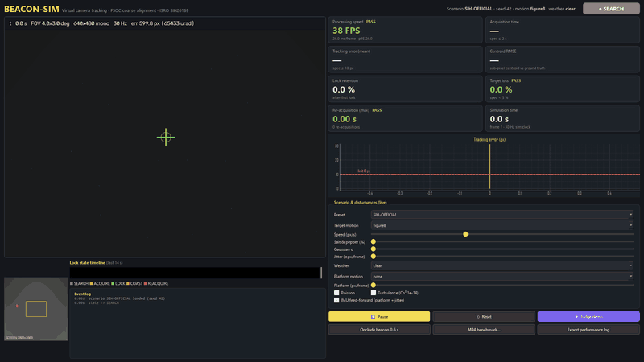
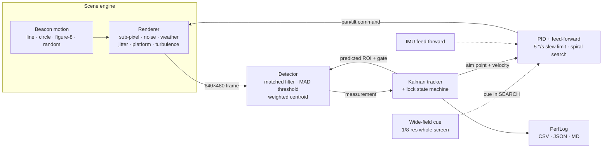

<div align="center">

# 🛰️ BEACON-SIM

### AI-based virtual camera tracking for coarse alignment of mobile FSOC terminals

**Find the beacon. Lock it. Keep it.**


-7c5cff)


Smart India Hackathon 2026 · Problem Statement **SIH26169** (ISRO) · Team **Larpers**



</div>

---

## Table of contents

- [Overview](#overview)
- [Features](#features)
- [Results](#results)
- [Quick start](#quick-start)
- [Usage](#usage)
- [How it works](#how-it-works)
- [Performance logs](#performance-logs)
- [Scenarios and configuration](#scenarios-and-configuration)
- [Project structure](#project-structure)
- [Testing](#testing)
- [Assumptions](#assumptions)
- [Roadmap](#roadmap)
- [License](#license)

## Overview

Free-space optical communication (FSOC) sends data on a very narrow laser beam, so two terminals on ships, vehicles, drones or satellites first have to find each other and point accurately. **Coarse alignment** is the job of a camera on a pan-tilt mount. The camera spots the partner's beacon, centres it and keeps it centred while both platforms move, vibrate and look through haze, fog, rain or turbulence.

BEACON-SIM is a complete, reproducible software testbed for that loop:

- **Scene:** a 2000 × 2000 px screen, with a moving square beacon on a sky and star background.
- **Camera:** a virtual 640 × 480 mono camera with a 4° × 3° field of view, running at 30 Hz. It starts pointed at the screen centre.
- **Tracking:** a detection → AI verification → IMM tracking → PID control pipeline drives the virtual mount within the official 5–10 °/s slew limits.
- **Scoring:** every run writes a performance log that is checked against the official ISRO specs.

| Official spec (SIH26169) | Target | BEACON-SIM (worst of 6 presets × 3 seeds) |
|---|---|---|
| Acquisition time | ≤ 2 s | **≤ 0.57 s** |
| Mean tracking error | ≤ 10 px | **≤ 5.6 px** |
| Target loss | < 5 % | **0 %** |
| Re-acquisition time | ≤ 1 s | **≤ 0.17 s** |
| Processing rate | ≥ 20 FPS | **≥ 48 FPS** |

With the default 4° / 640 px camera, 1 px = 109 µrad, so the 10 px limit is ≈ 1.1 mrad — the same order as NASA's 1 mrad coarse-pointing requirement for the LCOT → TBIRD uplink.

## Features

- 🎯 **Sub-pixel detection.** A matched filter, an adaptive median/MAD threshold and an intensity-weighted centroid give about 0.2 px RMSE against ground truth.
- 🤖 **AI verifier.** A 68k-parameter CNN, trained on 34,732 candidates mined from 900 simulated scenes (validation AUC 0.9989 on unseen scenes), vets detector candidates. It runs as ONNX inside OpenCV DNN: CPU only, no deep-learning framework at runtime. See [`results/ai_ablation.md`](results/ai_ablation.md).
- 🧭 **Robust tracking.** An IMM filter (calm + manoeuvre constant-velocity Kalman models) drives a `SEARCH → ACQUIRE → LOCK → COAST → REACQUIRE` state machine with M-of-N confirmation and gated re-acquisition.
- 🔭 **Wide-field acquisition cue.** A low-resolution whole-screen sensor (as on real FSOC terminals) cues the narrow camera, with two-frame confirmation.
- ⚖️ **Physical feasibility checker.** Compares the slew budget with platform + target motion and flags scenarios no real mount could meet.
- 🧩 **Every official parameter in the GUI.** A tabbed scenario editor covers rows 1–21.5 plus the optional rows (colour camera, multiple targets, shapes, waypoint motion, spiral platform, separate pan/tilt limits, control rate).
- 🎮 **Realistic mount control.** PID with velocity feed-forward, slew-rate limit, deadzone and an Archimedean spiral search.
- 🌫️ **Official disturbance set:**
  - noise: salt-and-pepper (up to 10 %), Gaussian (σ up to 20) and Poisson;
  - weather: haze, fog, rain and low light;
  - motion: ±20 px/frame LOS jitter and linear/circular/figure-8/random platform motion;
  - turbulence: Rytov-based scintillation, beam wander and blur;
  - occlusions.
- 🛰️ **IMU feed-forward.** Models gyro-aided stabilisation of platform motion and jitter; it can be turned off for ablation.
- 🎞️ **Benchmark-2 mode.** Grader MP4 in, PTZ loop bypassed: auto beacon-size estimation, tiled full-resolution search, colour/any resolution, no-GT support, false-alarm counting, per-frame centroid CSV, and folder batch mode against predefined thresholds.
- 📊 **Automatic performance logs.** Per-frame CSV, JSON and Markdown summaries plus a self-contained HTML report (charts, PASS/FAIL, feasibility, config) for every run.
- 🖥️ **Live dashboard.** Camera view, screen overview, lock-state timeline, event log, PASS/FAIL scorecards, error plot, live disturbance sliders and a one-click scripted **Judge demo**.
- 🔁 **Reproducible.** Seeded scenarios, YAML configs and identical results for identical seeds.
- 💻 **Lightweight.** Pure Python, CPU only, offline, no GPU and no paid licences.

## Results

Each preset ran for 3 seeds × 30 s ([`results/sweep/`](results/sweep/), table in [`results/sweep/sweep_table.md`](results/sweep/sweep_table.md)). **18 / 18 runs meet every official spec.**

| Preset | Disturbances | Acquisition | Mean error | Centroid RMSE | Target loss | Max re-acq. | Specs |
|---|---|---|---|---|---|---|---|
| `SIH-OFFICIAL` | clean, figure-8, occlusion | 0.07–0.47 s | 0.6–1.7 px | 0.04–0.05 px | 0 % | 0.03 s | ✅ 3/3 |
| `NOISY` | 10 % S&P, σ 20, Poisson, jitter 6 | 0.07–0.47 s | 0.6–1.7 px | 0.16–0.17 px | 0 % | 0.03 s | ✅ 3/3 |
| `FOG-JITTER` | fog, jitter 12, platform, circle | 0.47–0.53 s | 1.6–2.0 px | 0.14–0.15 px | 0 % | 0.03 s | ✅ 3/3 |
| `RAIN-LOWLIGHT` | rain, noise, random motion | 0.17–0.43 s | 2.4–2.7 px | 0.10 px | 0 % | 0.03 s | ✅ 3/3 |
| `SIH-MAX` | **every official maximum at once** (10 °/s) | 0.13–0.33 s | 4.0–4.1 px | 0.16–0.17 px | 0 % | 0.03 s | ✅ 3/3 |
| `SEVERE` | SIH maxima + haze + circular platform + turbulence | 0.13–0.57 s | 5.0–5.6 px | 0.44–0.48 px | 0 % | 0.17 s | ✅ 3/3 |

**Benchmark-2** ([`results/bench2/batch_report.md`](results/bench2/batch_report.md)): an 8-video grader-style suite (clean, max noise, fog + 5 px beacon, rain + 20 px, fast random motion in low light, circular beacon, colour 1920 × 1080, beacon-absent gaps), PTZ bypassed. **8 / 8 videos pass** the default thresholds: centroid RMSE 0.06–1.0 px, acquisition 0.07–0.37 s, lock retention ≥ 98.6 %, end-to-end 33–114 FPS including video decode.

**AI verifier ablation** ([`results/ai_ablation.md`](results/ai_ablation.md)): fog + max noise + 5 px beacon goes from *never acquired* to acquired in 1.6 s; dim low-light acquisition 1.5 → 1.0 s; SEVERE 5 px centroid RMSE 1.48 → 0.47 px; wrong-lock frames → 0.

**IMU feed-forward ablation** ([`results/sweep_no_imu/`](results/sweep_no_imu/)): without it, `SIH-MAX` mean error rises from 4.1 to 27.6 px and `SEVERE` from about 5.3 to 14.8 px (both fail); the other presets still pass.

> FPS is measured for the tracking pipeline (detection, AI verification, tracking and control) on a laptop CPU. Scene rendering and the GUI stand in for the real camera and are excluded. Benchmark-2 FPS is end-to-end, including decode.

## Quick start

Requirements: Python 3.10+ on Windows, Linux or macOS.

```bash
git clone <this-repo-url> beacon-sim
cd beacon-sim
python -m venv .venv
# Windows
.venv\Scripts\activate
# Linux / macOS
source .venv/bin/activate

pip install -r requirements.txt
python -m beacon_sim            # launch the dashboard
```

Click **★ Judge demo** for a scripted 40-second run. It steps through noise, occlusion, fog and jitter, rain, low light and platform motion, and haze and turbulence, then exports the performance log.

You can also install it as a package: `pip install -e .[dev]`, then run `beacon-sim`.

## Usage

| Command | What it does |
|---|---|
| `python -m beacon_sim` | Dashboard GUI |
| `python -m beacon_sim --judge` | GUI that starts the scripted judge demo |
| `python -m beacon_sim --mp4 video.mp4` | GUI in Benchmark-2 mode |
| `python -m beacon_sim --headless --preset NOISY --seed 7 --out runs` | Headless run that writes logs |
| `python -m beacon_sim --headless --scenario scenarios/severe.yaml` | Run a YAML scenario |
| `python -m beacon_sim --sweep --seeds 3 --duration 30 --out runs/sweep` | All presets × seeds, then a comparison table |
| `python -m beacon_sim --make-video samples/test.mp4 --preset NOISY --seconds 20` | Generate a grader-style MP4 plus a ground-truth CSV |
| `python -m beacon_sim --bench samples/test.mp4 [--gt gt.csv]` | Benchmark-2, headless |
| `... --no-imu` / `--no-ai` | Ablation: switch off IMU feed-forward / the CNN verifier (headless and sweep) |
| `python -m beacon_sim --bench-dir samples/suite [--thresholds th.yaml]` | Benchmark-2 batch over a folder → `batch_report.md` |
| `python -m beacon_sim --make-suite samples/suite` | Generate the 8-video grader-style test suite with ground truth |
| `python tools/train_verifier.py` | Re-train the AI verifier (PyTorch, CPU) → `beacon_sim/models/verifier.onnx` |

## How it works



| Stage | Method | File |
|---|---|---|
| Scene | Official 2000² screen. Box-coverage sub-pixel square beacon (5–20 px). Precomputed noise banks for speed. Weather as contrast/brightness models. Turbulence via Rytov variance → scintillation, beam wander and blur | [`scene.py`](beacon_sim/scene.py) |
| Detect | Optional median → local background subtraction → box matched filter → median + k·MAD threshold → connected components (top 25) → edge and SNR gating → scored candidate → intensity-weighted centroid | [`detect.py`](beacon_sim/detect.py) |
| Track | Constant-velocity Kalman filter (`filterpy`). Needs 3 hits to confirm LOCK and 2 misses to COAST. Coasts for 0.5 s, then REACQUIRE with a gate that grows over time | [`tracker.py`](beacon_sim/tracker.py) |
| Control | PID with velocity feed-forward, integral clamp, deadzone and saturation at the official pan/tilt rate. Archimedean spiral search while lost | [`control.py`](beacon_sim/control.py) |
| Loop | 30 Hz simulation. The camera starts at the screen centre. Adds the wide-field acquisition cue and IMU-aided stabilisation | [`sim.py`](beacon_sim/sim.py) |
| Metrics | Acquisition, tracking error (px and µrad), centroid RMSE, lock retention, target loss, re-acquisition and processing FPS. Pass/fail against `SPECS` | [`metrics.py`](beacon_sim/metrics.py) |
| Benchmark-2 | Coarse detection on a downscaled full frame → full-resolution ROI refinement → the same tracker, scored against a GT CSV | [`video_bench.py`](beacon_sim/video_bench.py) |
| GUI | PySide6 + pyqtgraph dashboard with live controls and a scripted judge demo | [`app.py`](beacon_sim/app.py) |

## Performance logs

Every headless run, sweep, benchmark or GUI export writes three files:

```
<scenario>_seed<N>_frames.csv     # one row per frame: state, truth, boresight, detection, errors, processing time
<scenario>_seed<N>_summary.json   # metrics + pass/fail + metadata (seed, config hash, Python, CPU)
<scenario>_seed<N>_summary.md     # human-readable table, e.g.:
```

| Metric | Value | Official spec | Result |
|---|---|---|---|
| acquisition_time_s | 0.267 | <= 2.0 | PASS |
| mean_tracking_error_px | 3.45 | <= 10.0 | PASS |
| target_loss_pct | 0.0 | < 5.0 | PASS |
| max_reacquisition_s | 0.033 | <= 1.0 | PASS |
| processing_fps | 211.1 | >= 20.0 | PASS |

## Scenarios and configuration

The presets are defined in [`config.py`](beacon_sim/config.py) and exported as YAML in [`scenarios/`](scenarios/). Copy one, edit it and run it with `--scenario`:

```yaml
name: MY-TEST
seed: 7
duration_s: 40.0
imu_aid: true
camera: { res_w: 640, res_h: 480, fov_x_deg: 4.0, fov_y_deg: 3.0, rate_hz: 30.0, max_pan_dps: 5.0 }
target: { size: 10, motion: figure8, speed: 120.0, occlusions: [[18.0, 0.6]] }
disturb: { salt_pepper: 0.10, gaussian_sigma: 20.0, poisson: true, jitter_px: 10.0,
           weather: fog, platform: linear, platform_px: 6.0, turbulence_cn2: 1.0e-14 }
```

Every log stores the scenario's SHA-256 config hash, so any number in a report can be traced back to its exact configuration.

## Project structure

```
beacon-sim/
├── beacon_sim/
│   ├── __main__.py      # CLI (GUI · headless · sweep · bench · make-video)
│   ├── app.py           # PySide6 dashboard + judge demo script
│   ├── config.py        # dataclasses, official specs, presets, YAML I/O
│   ├── scene.py         # screen, beacon motion, disturbance renderer
│   ├── detect.py        # beacon detector (sub-pixel centroid)
│   ├── tracker.py       # Kalman filter + lock state machine
│   ├── control.py       # pan-tilt PID + spiral search
│   ├── sim.py           # closed-loop simulation
│   ├── metrics.py       # performance log + spec checks
│   └── video_bench.py   # Benchmark-2 (MP4, PTZ bypassed) + test-video generator
├── scenarios/           # preset YAML files
├── results/             # committed sweep + ablation logs
├── samples/             # generated grader-style videos (git-ignored)
├── tests/               # pytest suite
├── docs/                # demo GIF + CI workflow template
├── pyproject.toml
└── requirements.txt
```

## Testing

```bash
python -m pytest -q
```

The suite has 40 tests (core, every official parameter row, GUI, Benchmark-2, reports, AI verifier) and runs in about 5 minutes. A ready-made GitHub Actions workflow is in [`docs/ci/tests.yml`](docs/ci/tests.yml); copy it to `.github/workflows/` to run the tests on every push. It covers the official spec values and camera geometry, sub-pixel centroid accuracy for every beacon shape and size, determinism, every preset including `SIH-MAX`, re-acquisition, the scenario editor, colour/16:9/no-ground-truth videos, batch thresholds, the HTML report and the AI verifier.

## Assumptions

- The problem statement gives the maximum Gaussian noise as "std 20 pixels". We read this as **intensity σ = 20 grey levels**.
- **Tracking error** is the distance between the true beacon and the camera boresight. It is measured from 0.5 s after the first lock, so the initial pull-in is excluded (acquisition time covers that). **Centroid error** is reported separately against ground truth.
- The **wide-field cue** models the low-resolution acquisition sensor that real FSOC terminals use. All detection, tracking and metrics use the narrow 640 × 480 camera.
- **IMU feed-forward** assumes a gyro that measures platform rate with about 2 % error and LOS jitter with about 15 % residual.

## Roadmap

- [ ] Constant-acceleration and IMM tracker variants
- [ ] Real camera input (USB / GigE) and serial pan-tilt driver
- [ ] One-file PyInstaller `.exe` release
- [ ] PDF report export

## License

Released under the [MIT License](LICENSE).

<div align="center">
<sub>Built by <b>Team Larpers</b> for Smart India Hackathon 2026 · Problem statement SIH26169 by ISRO</sub>
</div>
